Selenium IDE 
============

.. _chapter02-reference:

Introduction 
------------
The Selenium-IDE (Integrated Development Environment) is the tool you use to 
develop your Selenium test cases.  It's an easy-to-use Chrome and Firefox extension 
and is generally the most efficient way to develop test cases.   It records 
the users actions in the browser for you, using existing Selenium commands, 
with parameters defined by the context of that element.  This is not only a 
time-saver, but also an excellent way of learning Selenium script syntax.

This chapter is all about the Selenium IDE and how to use it effectively. 
  
Installing the IDE 
------------------
Download the IDE using `Chrome`_ or `Firefox`_

.. _`Chrome`: https://chrome.google.com/webstore/detail/selenium-ide/mooikfkahbdckldjjndioackbalphokd
.. _`Firefox`: https://addons.mozilla.org/en-GB/firefox/addon/selenium-ide/
  
Click on Add to Chrome or Add to Firefox.  After Installation a button 
will appear on the right hand side of the address bar.

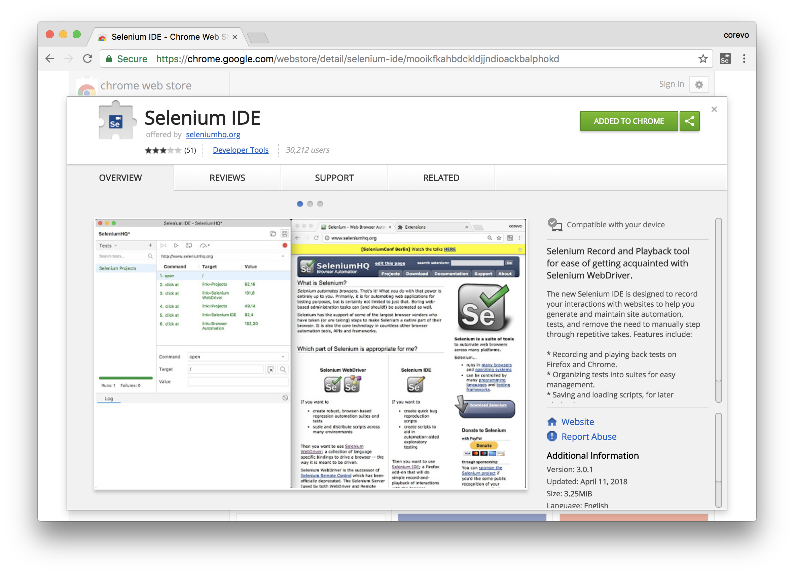

Opening the IDE 
---------------
To run the Selenium IDE, simply click the button to the right of the address bar.  
It opens as follows with an empty script-editing window and buttons to open a project 
or save one.  

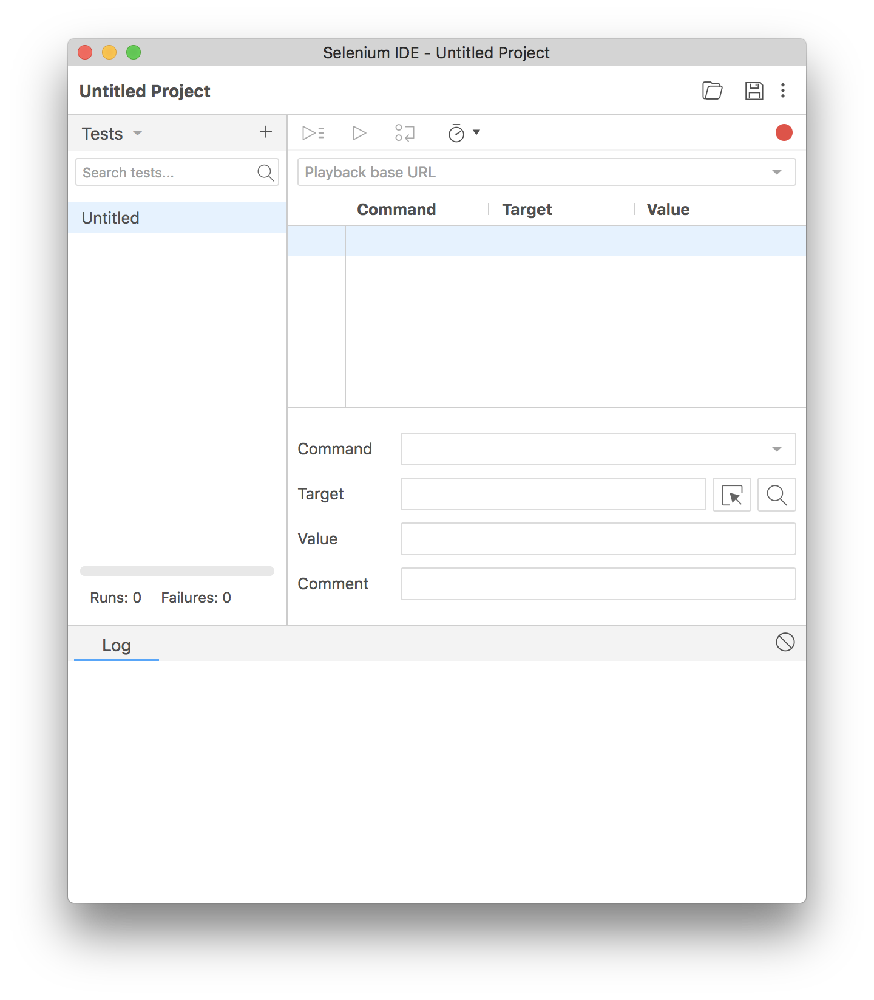
  
IDE Features  
------------
  
Toolbar 
++++++++
The toolbar contains buttons for controlling the execution of your test 
cases, including a step feature for debugging your test cases.  The right-most 
button, the one with the red-dot, is the record button.  
  
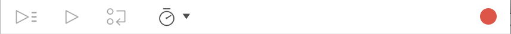
  
|speed control|
    Speed Control:  controls how fast your test case runs. 
|run all|
    Run All: Runs the entire test suite when a test suite with multiple test 
    cases is loaded. 
|run|
    Run:  Runs the currently selected test.  When only a single test is 
    loaded this button and the Run All button have the same effect.  
|pause|
    Pause/Resume:  Allows pausing and resuming of the running test case.
|stop|
    Stop:  Stops the current running test case.
|step|
    Step:  Allows you to "step" through a test case by running it one command at a 
    time.  Use for debugging test cases. 

|record|
    Record:  Records the user's browser actions.  

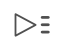
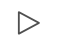

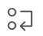

 
Test Case Panel
+++++++++++++++
Your script is displayed in the test case panel.  

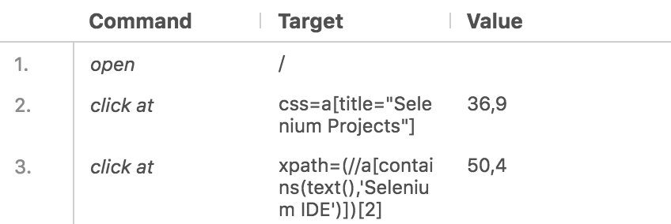
  
The Command, Target, and Value entry fields display the currently selected 
command along with its parameters.  These are entry fields where you 
can modify the currently selected command.  The first parameter specified for
a command in the Reference tab of the bottom pane always goes in the Target
field.  If a second parameter is specified by the Reference tab, it always
goes in the Value field.  The Comment field allows you to specify in a human 
readable format a description of the current command.  
  
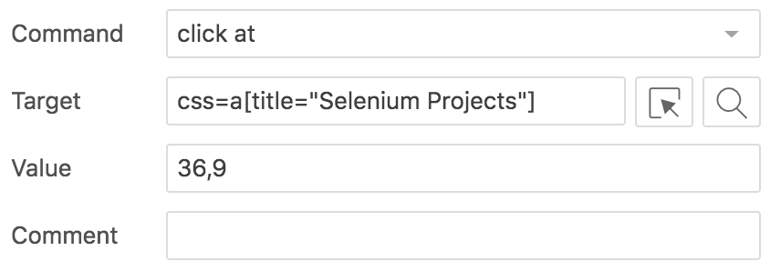
  
If you start typing in the Command field, a drop-down list will be populated 
based on the first characters you type; you can then select your desired 
command from the drop-down. 
  
Navigation Panel
++++++++++++++++
Navigation between test cases and test suites is done through the right hand side 
of Selenium IDE.  Clicking on Tests with the small caret will open up a menu.  

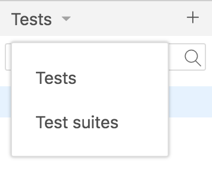
 
When saving the project will be saved as the new **.side** format, which will 
include all test cases and suites combined.  It is refered to as a project.

Console Panel
+++++++++++++
The bottom pane, called Console Panel for it's similarity with web devtools, 
is used for different utility functions: Log, Reference, depending on which tab 
is selected.

Log
~~~

When you run your test case, error messages
and information messages showing the progress are displayed 
in this pane automatically, even if you do not first select the Log
tab.  These messages are often useful for test case debugging.   Notice the Clear 
button for clearing the Log.    

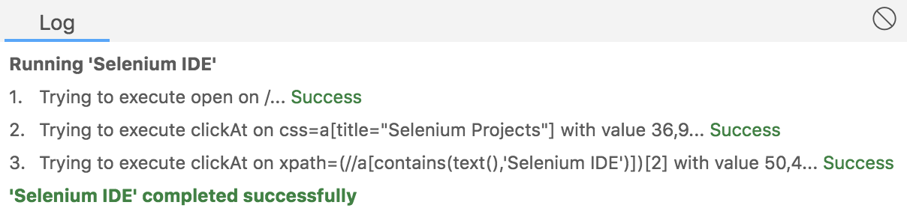

Reference
~~~~~~~~~

The Reference tab is currently under development, and will be added shortly.
     
Migrating From the Legacy IDE
-----------------------------

Loading Legacy Test Cases and Suites
++++++++++++++++++++++++++++++++++++
To load a test case simply open it using the folder button, it'll load up 
automatically, and will save as the new *.side* format when saved.  

A test suite take a few extra steps, after loading a suite using the folder 
button, a dialog will require uploading the test cases referenced in the suite.  

.. image:: images/chapt2_img19_Import_Dialog.png
   :class: align-center
   :width: 300 px

After uploading all the test cases, the dialog will automatically close, 
and the test suite with it's cases will be ready to be executed.

AndWait and waitFor are gone?
+++++++++++++++++++++++++++++

Selenium IDE will now automatically wait for you, at every command, 
every command will wait for the page to load.  Commands which take a locator 
will wait for the element to appear.  Hopefully this will eliminate the need 
for explicit waiting.  In case that is not enough, the pause command can be used 
instead.

Building Test Cases
-------------------
There are three primary methods for developing test cases.  Frequently, 
a test
developer will require all three techniques. 

Recording  
+++++++++
Many first-time users begin by recording a test case from their interactions 
with a website.  When Selenium-IDE is first opened, the record button is OFF by 
default, unlike previous version of it.  

During recording, Selenium-IDE will automatically insert commands into your 
test case based on your actions.  Typically, this will include:
  
* clicking a link - *click* or *click at* commands 
* entering values - *type* command 
* selecting options from a drop-down listbox - *select* command 
* clicking checkboxes or radio buttons - *click* command 
  
Here are some "gotchas" to be aware of:
  
* The *type* command may require clicking on some other area of the web page 
  for it to record.  
  
Adding Verifications and Asserts With the Context Menu 
++++++++++++++++++++++++++++++++++++++++++++++++++++++
  
Your test cases will also need to check the properties of a web-page.  This 
requires *assert* and *verify* commands.  We won't describe the specifics of 
these commands here; that is in the chapter on `Selenium Commands -- "Selenese"`_.  Here we'll 
simply describe how to add them to your test case. 
  
With Selenium IDE recording, go to the browser displaying your test application and 
right click anywhere on the page.  You will see a context menu showing *verify* 
and/or *assert* commands.  

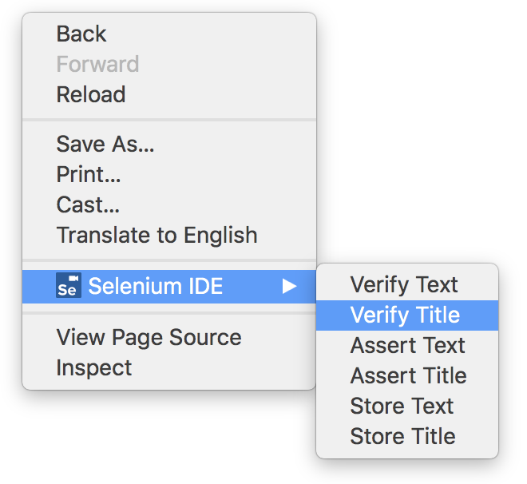

The first time you use Selenium, there may only be one Selenium command listed.
As you use the IDE however, you will find additional commands will quickly be
added to this menu.  Selenium-IDE will attempt to predict what command, along 
with the parameters, you will need for a selected UI element on the current 
web-page. 
  
Let's see how this works. Open a web-page of your choosing and select a block 
of text on the page. A paragraph or a heading will work fine.  Now, right-click
the selected text.  The context menu should give you a *verifyTextPresent*
command and the suggested parameter should be the text itself. 
  
Also, notice the Show All Available Commands menu option.  This shows many, 
many more commands, again, along with suggested parameters, for testing your 
currently selected UI element. 
  
Try a few more UI elements. Try right-clicking an image, or a user control 
like a button or a checkbox.  You may need to use Show All Available Commands 
to see options other than *verifyTextPresent*. Once you select these other 
options, the more commonly used ones will show up on the primary context menu.
For example, selecting *verifyElementPresent* for an image should later cause 
that command to be available on the primary context menu the next time you 
select an image and right-click. 
  
Again, these commands will be explained in detail in the chapter on Selenium 
commands.  For now though, feel free to use the IDE to record and select 
commands into a test case and then run it.  You can learn a lot about 
the Selenium commands simply by experimenting with the IDE. 
  
Editing  
+++++++
Insert Command 
~~~~~~~~~~~~~~
Select the point in your test case where you want to insert the command.  
To do this, in the Test Case Panel, left-click on the line where you want 
to insert a new command.  Right-click and select Insert Command; the IDE 
will add a blank line just ahead of the line you selected. Now use the 
command editing text fields to enter your new command and its parameters. 

  
Insert Comment 
~~~~~~~~~~~~~~
Comments may be added to make your test case more readable. 

Comments will hide the details of the Command with the readable text you 
sepecify.

Edit a Command or Comment 
~~~~~~~~~~~~~~~~~~~~~~~~~

Simply select the line to be changed and edit it using the Command, Target, Value 
and Comment fields. 

Opening and Saving a Test Case
++++++++++++++++++++++++++++++
To save a Selenium IDE project, click the save button at the top right hand side, 
Selenium IDE will download a **.side** file, which contains all test cases and suites.

When you open an existing test case or suite, Selenium-IDE
displays the test cases and suites at the left hand side panel, and the commands at 
the table.
  
Running Test Cases
------------------
  
The IDE allows many options for running your test case. You can run a test case
all at once, stop and start it, run it one line at a time, run a single command 
you are currently developing, and you can do a batch run of an entire test suite.
Execution of test cases is very flexible in the IDE. 
  
Run a Test Case
    Click the Run button to run the currently displayed test case. 
  
Run a Test Suite
    Click the Run All button to run all the test cases in the currently loaded 
    test suite. 
  
Pause and Start
    The Pause button can be used to stop the test case while it is running.  The 
    icon of this button then changes to indicate the run is paused.  To continue
    click it again, or click the Run button. 
  
Stop in the Middle
    You can set a breakpoint in the test case to cause it to stop on a 
    particular command.  This is useful for debugging your test case. To set a 
    breakpoint, select a command, right-click, and from the context menu 
    select Toggle Breakpoint. 
  
Start from the Middle
    You can tell the IDE to begin running from a specific command in the 
    middle of the test case.  This also is used for debugging.  to play from a 
    specific command, select a command, right-click, and from the context menu 
    click Play from here. 
  
Run Any Single Command
    Double-click any single command to run it by itself.  This is useful when 
    writing a single command.  It lets you immediately test a command you are 
    constructing, when you are not sure if it is correct.  You can double-click it to 
    see if it runs correctly.  This is also available from the context menu.
  

Using Base URL to Run Test Cases in Different Domains 
-----------------------------------------------------
The *Base URL* field at the top of the Selenium-IDE window is very useful
for allowing test cases to be run across different domains. 
Suppose that a site named \https://news.portal.com had an in-house beta site named
\https://beta.news.portal.com.  Any test cases for these sites that begin with
an *open*
statement should specify a *relative URL* as the argument to *open*
rather than an *absolute URL* (one
starting with a protocol such as http: or https:).  Selenium-IDE will
then create an absolute URL by appending the *open* command's
argument onto the end of the value of Base URL.  For example, the 
test case below would be run against \https://news.portal.com/about.html:

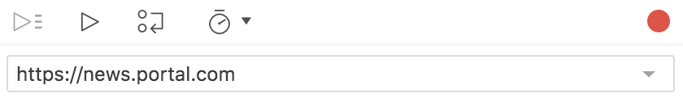

This same test case with a modified Base URL setting would be run against
\https://beta.news.portal.com/about.html:

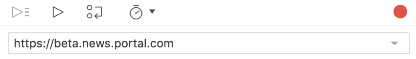

.. _Selenese:

Selenium Commands -- "Selenese" 
-------------------------------
Selenium commands, often called *selenese*, are the set of commands that run 
your tests.  A sequence of these commands is a *test script*.  Here we explain 
those commands in detail, and we present the many choices you have in testing 
your web application when using Selenium.

Selenium provides a rich set of commands for fully testing your web-app 
in virtually any way you can imagine. The command set is often called 
*selenese*. These commands essentially create a testing language. 

In selenese, one can test the existence of UI elements based 
on their HTML tags, test for specific content, test for broken links, 
input fields, selection list options, submitting forms, and table data among
other things. In addition Selenium commands support testing of window size,
mouse position, alerts, Ajax functionality, pop up windows, event handling,
and many other web-application features. For details on available commands,
what they're used for, and what parameters they take see the Reference tab
when using the IDE.

A *command* tells Selenium what to do. Selenium commands come in 
three "flavors": **Actions**, **Accessors**, and **Assertions**. 

* **Actions** are commands that generally manipulate the state of the 
  application. They do things like "click this link" and "select that option". 
  If an Action fails, or has an error, the execution of the current test is 
  stopped.  

* **Accessors** examine the state of the application and store the results in 
  variables, e.g. "storeTitle". They are also used to automatically generate 
  Assertions. 

* **Assertions** are like Accessors, but they verify that the state of the 
  application conforms to what is expected. Examples include "make sure the 
  page title is X" and "verify that this checkbox is checked". 

  All Selenium Assertions can be used in 2 modes: "assert" and "verify". 
  For example, you can "assertText" and "verifyText". 
  When an "assert" fails, the test is aborted. When a "verify" fails, the test 
  will continue execution, logging the failure. This allows a single "assert" 
  to ensure that the application is on the correct page, followed by a bunch of 
  "verify" assertions to test form field values, labels, etc. 

Script Syntax 
-------------
Selenium commands are simple, they consist of the command and two parameters. 
For example:

==========  ===========  =====
verifyText  //div//a[2]  Login 
==========  ===========  =====

The parameters are not always required; it depends on the command. In some 
cases both are required, in others one parameter is required, and in still 
others the command may take no parameters at all. Here are a couple more 
examples:
  
========================  ===========   =======================
chooseCancelOnNextPrompt
pause                     500
type                      id=phone      \(555\) 666-7066 
type                      id=address1   \\${myVariableAddress} 
========================  ===========   =======================
 
The command reference describes the parameter requirements for each command. 
  
Parameters vary, however they are typically:
  
* a *locator* for identifying a UI element within a page. 
* a *text pattern* for verifying or asserting expected page content 
* a *text pattern* or a selenium variable for entering text in an input field 
  or for selecting an option from an option list. 

Locators, text patterns, 
selenium variables, and the commands themselves are described in considerable
detail in the section on Selenium Commands. 
  
Test Suites 
------------
A test suite is a collection of tests.  Often one will run all the tests in a
test suite as one continuous batch-job.  

When using Selenium-IDE, test suites also can be created by changing to Test Suites 
view and clicking on the plus button.

Commonly Used Selenium Commands 
--------------------------------
To conclude our introduction of Selenium, we'll show you a few typical Selenium
commands.  These are probably the most commonly used commands for building tests.

open
   opens a page using a URL.
click
   performs a click operation, and optionally waits for a new page to load.
verifyTitle/assertTitle
   verifies an expected page title.
verifyTextPresent
   verifies expected text is somewhere on the page.
verifyElementPresent
   verifies an expected UI element, as defined by its HTML tag, is present on
   the page.
verifyText
   verifies expected text and its corresponding HTML tag are present on the page.
verifyTable
   verifies a table's expected contents.

Verifying Page Elements
------------------------
Verifying UI elements on a web page is probably the most common feature of 
your automated tests.  Selenese allows multiple ways of checking for UI 
elements.  It is important that you understand these different methods because
these methods define what you are actually testing.

For example, will you test that...

a) an element is present somewhere on the page?
b) specific text is somewhere on the page?
c) specific text is at a specific location on the page?

For example, if you are testing a text heading, the text and its position
at the top of the page are probably relevant for your test.  If, however, you 
are testing for the existence of an image on the home page, and the 
web designers frequently change the specific image file along with its position
on the page, then you only want to test that *an image* (as opposed to the 
specific image file) exists *somewhere on the page*.
   
   
Assertion or Verification? 
--------------------------
Choosing between "assert" and "verify" comes down to convenience and 
management of failures. There's very little point checking that the first 
paragraph on the page is the correct one if your test has already failed when 
checking that the browser is displaying the expected page. If you're not on 
the correct page, you'll probably want to abort your test case so that you can 
investigate the cause and fix the issue(s) promptly. On the other hand, you 
may want to check many attributes of a page without aborting the test case on 
the first failure as this will allow you to review all failures on the page 
and take the appropriate action. Effectively an "assert" will fail the test 
and abort the current test case, whereas a "verify" will fail the test and 
continue to run the test case. 

The best use of this feature is to logically group your test commands, and 
start each group with an "assert" followed by one or more "verify" test 
commands. An example follows:

====================    ====================  ============
**Command**             **Target**            **Value**
====================    ====================  ============
open                    /projects/ide/      
assertTitle             Selenium IDE       
verifyElementPresent    css=#mainContent img
====================    ====================  ============

The above example first opens a page and then "asserts" that the correct page 
is loaded by comparing the title with the expected value. Only if this passes 
will the following command run and "verify" that the image is present in the 
expected location.

verifyElementPresent
++++++++++++++++++++
Use this command when you must test for the presence of a specific UI 
element, rather than its content.  This verification does not check the text,
only the HTML tag.  One common use is to check for the presence of an image. 

====================   ==================   ============
**Command**            **Target**           **Value**
====================   ==================   ============
verifyElementPresent   //div/p/img               
====================   ==================   ============
   
This command verifies that an image, specified by the existence of an  
HTML tag, is present on the page, and that it follows a 
 tag and a 
 tag.
The first (and only) parameter is a *locator* for telling the Selenese command how to 
find the element.  Locators are explained in the next section.  

``verifyElementPresent`` can be used to check the existence of any HTML tag 
within the page. You can check the existence of links, paragraphs, divisions 

, etc.  Here are a few more examples.  

====================   ==============================	============
**Command**            **Target**           		**Value**
====================   ==============================   ============
verifyElementPresent   //div/p 
verifyElementPresent   //div/a               
verifyElementPresent   id=Login
verifyElementPresent   link=Go to Marketing Research               
verifyElementPresent   //a[2]
verifyElementPresent   //head/title
====================   ==============================   ============

These examples illustrate the variety of ways a UI element may be tested.  
Again, locators are explained in the next section.

verifyText
++++++++++

Use ``verifyText`` when both the text and its UI element must be tested.
``verifyText`` must use a locator.  If you choose an *XPath* or *DOM*
locator, you can verify that specific text appears at a specific location on the
page relative to other UI components on the page.

===========  ===================    ===================================================================
**Command**  **Target**  	    **Value**
===========  ===================    ===================================================================
verifyText   //table/tr/td/div/p    This is my text and it occurs right after the div inside the table.
===========  ===================    ===================================================================

.. _locators-section:

Locating Elements 
-----------------
For many Selenium commands, a target is required. This target identifies an 
element in the content of the web application, and consists of the location 
strategy followed by the location in the format ``locatorType=location``. The 
locator type can be omitted in many cases.
The various locator types
are explained below with examples for each.

Locating by Identifier
++++++++++++++++++++++
This is probably the most common method of locating elements and is the 
catch-all default when no recognized locator type is used. With this strategy,
the first element with the id attribute value matching the location will be used. If
no element has a matching id attribute, then the first element with a name 
attribute matching the location will be used.

For instance, your page source could have id and name attributes 
as follows:
           
.. code-block:: html
  :linenos: 

  <html>
   <body>
    <form id="loginForm">
     <input name="username" type="text" />
     <input name="password" type="password" />
     <input name="continue" type="submit" value="Login" />
    </form>
   </body>
  <html>

The following locator strategies would return the elements from the HTML 
snippet above indicated by line number:

- ``identifier=loginForm`` (3)
- ``identifier=password`` (5)
- ``identifier=continue`` (6)
- ``continue`` (6)

Since the ``identifier`` type of locator is the default, the ``identifier=``
in the first three examples above is not necessary.

Locating by Id 
~~~~~~~~~~~~~~
This type of locator is more limited than the identifier locator type, but 
also more explicit. Use this when you know an element's id attribute.

.. code-block:: html
  :linenos:
  
   <html>
    <body>
     <form id="loginForm">
      <input name="username" type="text" />
      <input name="password" type="password" />
      <input name="continue" type="submit" value="Login" />
      <input name="continue" type="button" value="Clear" />
     </form>
    </body>
   <html>

- ``id=loginForm`` (3)

Locating by Name 
~~~~~~~~~~~~~~~~
The name locator type will locate the first element with a matching name 
attribute. If multiple elements have the same value for a name attribute, then 
you can use filters to further refine your location strategy. The default 
filter type is value (matching the value attribute).  

.. code-block:: html
  :linenos:
  
   <html>
    <body>
     <form id="loginForm">
      <input name="username" type="text" />
      <input name="password" type="password" />
      <input name="continue" type="submit" value="Login" />
      <input name="continue" type="button" value="Clear" />
     </form>
   </body>
   <html>

- ``name=username`` (4)
- ``name=continue value=Clear`` (7)
- ``name=continue Clear`` (7)
- ``name=continue type=button`` (7)

.. note:: Unlike some types of XPath and DOM locators, the three
   types of locators above allow Selenium to test a UI element independent 
   of its location on 
   the page.  So if the page structure and organization is altered, the test 
   will still pass.  You may or may not want to also test whether the page 
   structure changes.  In the case where web designers frequently alter the 
   page, but its functionality must be regression tested, testing via id and 
   name attributes, or really via any HTML property, becomes very important.

Locating by XPath 
~~~~~~~~~~~~~~~~~
XPath is the language used for locating nodes in an XML document. As HTML can 
be an implementation of XML (XHTML), Selenium users can leverage this powerful 
language to target elements in their web applications. XPath extends beyond (as 
well as supporting) the simple methods of locating by id or name 
attributes, and opens up all sorts of new possibilities such as locating the 
third checkbox on the page.

One of the main reasons for using XPath is when you don't have a suitable id 
or name attribute for the element you wish to locate. You can use XPath to 
either locate the element in absolute terms (not advised), or relative to an 
element that does have an id or name attribute.  XPath locators can also be
used to specify elements via attributes other than id and name.

Absolute XPaths contain the location of all elements from the root (html) and 
as a result are likely to fail with only the slightest adjustment to the 
application. By finding a nearby element with an id or name attribute (ideally
a parent element) you can locate your target element based on the relationship.
This is much less likely to change and can make your tests more robust.

Since only ``xpath`` locators start with "//", it is not necessary to include
the ``xpath=`` label when specifying an XPath locator.

.. code-block:: html
  :linenos:
  
   <html>
    <body>
     <form id="loginForm">
      <input name="username" type="text" />
      <input name="password" type="password" />
      <input name="continue" type="submit" value="Login" />
      <input name="continue" type="button" value="Clear" />
     </form>
   </body>
   <html>

.. TODO: mam-p:  Is the fourth example below correct?

- ``xpath=/html/body/form[1]`` (3) - *Absolute path (would break if the HTML was 
  changed only slightly)*
- ``//form[1]`` (3) - *First form element in the HTML*
- ``xpath=//form[@id='loginForm']`` (3) - *The form element with attribute named 'id' and the value 'loginForm'*
- ``xpath=//form[input/@name='username']`` (3) - *First form element with an input child
  element with attribute named 'name' and the value 'username'*
- ``//input[@name='username']`` (4) - *First input element with attribute named 'name' and the value 
  'username'*
- ``//form[@id='loginForm']/input[1]`` (4) - *First input child element of the 
  form element with attribute named 'id' and the value 'loginForm'*
- ``//input[@name='continue'][@type='button']`` (7) - *Input with attribute named 'name' and the value 'continue'
  and attribute named 'type' and the value 'button'*
- ``//form[@id='loginForm']/input[4]`` (7) - *Fourth input child element of the 
  form element with attribute named 'id' and value 'loginForm'*

These examples cover some basics, but in order to learn more, the 
following references are recommended:

* `W3Schools XPath Tutorial <http://www.w3schools.com/xml/xpath_intro.asp>`_ 
* `W3C XPath Recommendation <http://www.w3.org/TR/xpath>`_

You can copy an XPath using the browser's devtools:

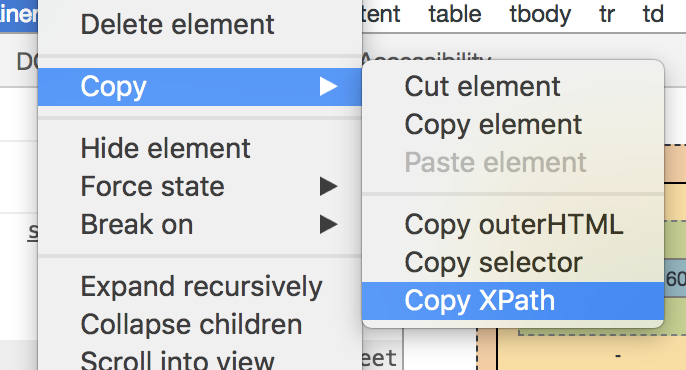

Locating Hyperlinks by Link Text 
~~~~~~~~~~~~~~~~~~~~~~~~~~~~~~~~

This is a simple method of locating a hyperlink in your web page by using the 
text of the link. If two links with the same text are present, then the first 
match will be used.

.. code-block:: html
  :linenos:

  <html>
   <body>
    
Are you sure you want to do this?

    <a href="continue.html">Continue</a> 
    <a href="cancel.html">Cancel</a>
  </body>
  <html>

- ``link=Continue`` (4)
- ``link=Cancel`` (5)

Locating by CSS
~~~~~~~~~~~~~~~
CSS (Cascading Style Sheets) is a language for describing the rendering of HTML
and XML documents. CSS uses Selectors for binding style properties to elements
in the document. These Selectors can be used by Selenium as another locating 
strategy.

.. code-block:: html
  :linenos:

   <html>
    <body>
     <form id="loginForm">
      <input class="required" name="username" type="text" />
      <input class="required passfield" name="password" type="password" />
      <input name="continue" type="submit" value="Login" />
      <input name="continue" type="button" value="Clear" />
     </form>
   </body>
   <html>

- ``css=form#loginForm`` (3)
- ``css=input[name="username"]`` (4)
- ``css=input.required[type="text"]`` (4)
- ``css=input.passfield`` (5)
- ``css=#loginForm input[type="button"]`` (7)
- ``css=#loginForm input:nth-child(2)`` (5)

For more information about CSS Selectors, the best place to go is `the W3C 
publication <http://www.w3.org/TR/css3-selectors/>`_.  You'll find additional
references there.

.. note:: Most experienced Selenium users recommend CSS as their locating
   strategy of choice as it's considerably faster than XPath and can find the 
   most complicated objects in an intrinsic HTML document.

Implicit Locators 
~~~~~~~~~~~~~~~~~
You can choose to omit the locator type in the following situations:

 - Locators without an explicitly defined locator strategy will default
   to using the identifier locator strategy. See `Locating by Identifier`_.
   
 - Locators starting with "//" will use the XPath locator strategy. 
   See `Locating by XPath`_.   

.. _patterns-section:

Store Commands and Selenium Variables
-------------------------------------
You can use Selenium variables to store constants at the 
beginning of a script.  Also, when combined with a data-driven test design 
(discussed in a later section), Selenium variables can be used to store values 
passed to your test program from the command-line, from another program, or from
a file.
 
The plain *store* command is the most basic of the many store commands and can be used 
to simply store a constant value in a selenium variable.  It takes two 
parameters, the text value to be stored and a selenium variable.  Use the 
standard variable naming conventions of only alphanumeric characters when 
choosing a name for your variable.

============   ===============	 =========
**Command**    **Target**        **Value**
============   ===============   =========
store          paul@mysite.org   userName               
============   ===============   =========

Later in your script, you'll want to use the stored value of your 
variable.  To access the value of a variable, enclose the variable in 
curly brackets ({}) and precede it with a dollar sign like this.

============  ==========  ===========
**Command**   **Target**  **Value**
============  ==========  ===========
verifyText    //div/p     \\${userName}               
============  ==========  ===========

A common use of variables is for storing input for an input field.

============  ==========   ===========
**Command**   **Target**   **Value**
============  ==========   ===========
type	      id=login     \\${userName}               
============  ==========   ===========

Selenium variables can be used in either the first or second parameter and 
are interpreted by Selenium prior to any other operations performed by the 
command.  A Selenium variable may also be used within a locator expression.

An equivalent store command exists for each verify and assert command.  Here 
are a couple more commonly used store commands.

storeText 
+++++++++
StoreText corresponds to verifyText.  It uses a locater to identify specific 
page text.  The text, if found, is stored in the variable.  StoreText can be 
used to extract text from the page being tested.

*echo* - The Selenese Print Command
------------------------------------
Selenese has a simple command that allows you to print text to your test's 
output.  This is useful for providing informational progress notes in your 
test which display on the console as your test is running.  These notes also can be 
used to provide context within your test result reports, which can be useful 
for finding where a defect exists on a page in the event your test finds a 
problem.  Finally, echo statements can be used to print the contents of 
Selenium variables.

============       ========================   =========
**Command**        **Target**                 **Value**
============   	   ========================   =========
echo    	   Testing page footer now.    
echo    	   Username is \\${userName}                 
============   	   ========================   =========

Alerts, Popups, and Multiple Windows
------------------------------------
Suppose that you are testing a page that looks like this.

.. code-block:: html
  :linenos:
  
  <!DOCTYPE HTML>
  <html>
  <head>
    
  </head>
  <body>

    <input type="button" id="btnConfirm" onclick="show_confirm()" value="Show confirm box" />
    <input type="button" id="btnAlert" onclick="show_alert()" value="Show alert" />
    <input type="button" id="btnPrompt" onclick="show_prompt()" value="Show prompt" />
    <a href="newWindow.html" id="lnkNewWindow" target="_blank">New Window Link</a>
    <input type="button" id="btnNewNamelessWindow" onclick="open_window()" value="Open Nameless Window" />
    <input type="button" id="btnNewNamedWindow" onclick="open_window('Mike')" value="Open Named Window" />

     
    
    
  </body>
  </html>

The user must respond to alert/confirm boxes, as well as moving focus to newly 
opened popup windows. Fortunately, Selenium can cover JavaScript pop-ups.

But before we begin covering alerts/confirms/prompts in individual detail, it is
helpful to understand the commonality between them. Alerts, confirmation boxes 
and prompts all have variations of the following 

===========================     ================================================================
**Command**                     **Description**
===========================     ================================================================
assertFoo(*pattern*)            throws error if *pattern* doesn't match the text of the pop-up
assertFooPresent                throws error if pop-up is not available
assertFooNotPresent             throws error if any pop-up is present
storeFoo(*variable*)            stores the text of the pop-up in a variable
storeFooPresent(*variable*)     stores the text of the pop-up in a variable and returns true or false
===========================     ================================================================

When running under Selenium, JavaScript pop-ups will not appear. This is because
the function calls are actually being overridden at runtime by Selenium's own
JavaScript. However, just because you cannot see the pop-up doesn't mean you don't
have to deal with it. To handle a pop-up, you must call its ``assertFoo(pattern)``
function. If you fail to assert the presence of a pop-up your next command will be 
blocked and you will get an error similar to the following ``[error] Error: There
was an unexpected Confirmation! [Chose an option.]``

Alerts
++++++
Let's start with alerts because they are the simplest pop-up to handle. To begin,
open the HTML sample above in a browser and click on the "Show alert" button. You'll
notice that after you close the alert the text "Alert is gone." is displayed on the
page. Now run through the same steps with Selenium IDE recording, and verify
the text is added after you close the alert. Your test will look something like
this:

==================    ============================================   ===========
 **Command**           **Target**                                     **Value**
==================    ============================================   ===========
open                   /                                             
click                  btnAlert                                       
assertAlert            I'm blocking!
verifyTextPresent      Alert is gone.
==================    ============================================   ===========

You may be thinking "That's odd, I never tried to assert that alert." But this is
Selenium-IDE handling and closing the alert for you. If you remove that step and replay
the test you will get the following error ``[error] Error: There was an unexpected
Alert! [I'm blocking!]``. You must include an assertion of the alert to acknowledge 
its presence.
 
If you just want to assert that an alert is present but either don't know or don't care
what text it contains, you can use ``assertAlertPresent``. This will return true or false,
with false halting the test.

Confirmations
+++++++++++++
Confirmations behave in much the same way as alerts, with ``assertConfirmation`` and
``assertConfirmationPresent`` offering the same characteristics as their alert counterparts.
However, by default Selenium will select OK when a confirmation pops up. Try recording
clicking on the "Show confirm box" button in the sample page, but click on the "Cancel" button
in the popup, then assert the output text. Your test may look something like this:

===============================    ============================================   ===========
 **Command**                        **Target**                                     **Value**
===============================    ============================================   ===========
open                                     /                                             
click                                    btnConfirm                                       
chooseCancelOnNextConfirmation
assertConfirmation                       Choose an option.
verifyTextPresent                        Rejected
===============================    ============================================   ===========

The ``chooseCancelOnNextConfirmation`` function tells Selenium that all following
confirmation should return false. It can be reset by calling chooseOkOnNextConfirmation.

You may notice that you cannot replay this test, because Selenium complains that there
is an unhandled confirmation. This is because the order of events Selenium-IDE records
causes the click and chooseCancelOnNextConfirmation to be put in the wrong order (it makes sense 
if you think about it, Selenium can't know that you're cancelling before you open a confirmation)
Simply switch these two commands and your test will run fine.

Prompts
+++++++
Prompts behave in much the same way as alerts, with ``assertPrompt`` and ``assertPromptPresent`` offering the same characteristics as their alert counterparts. By default, Selenium will wait for you to input data when the prompt pops up. Try recording clicking on the "Show prompt" button in the sample page and enter "Selenium" into the prompt. Your test may look something like this:

=====================    =============================    =====================
 **Command**             **Target**                       **Value**
=====================    =============================    =====================
open                     /
answerOnNextPrompt       Selenium!
click                    id=btnPrompt
assertPrompt             What's the best web QA tool?
verifyTextPresent        Selenium!
=====================    =============================    =====================

If you choose cancel on the prompt, you may notice that answerOnNextPrompt will simply show a target of blank. Selenium treats cancel and a blank entry on the prompt basically as the same thing.

Debugging 
---------
Debugging means finding and fixing errors in your test case.  This is a normal 
part of test case development. 
  
We won't teach debugging here as most new users to Selenium will already have 
some basic experience with debugging.  If this is new to you, we recommend 
you ask one of the developers in your organization. 

Breakpoints 
+++++++++++
 
The Selelenium IDE supports the setting of breakpoints and the ability to start and 
stop the running of a test case, from any point within the test case.  That is, one 
can run up to a specific command in the middle of the test case and inspect how 
the test case behaves at that point.  To do this, set a breakpoint on the 
command you wish to examine.  
  
To set a breakpoint, select a command, right-click, and from the context menu 
select *Toggle Breakpoint*.  Then click the Run button to run your test case from 
the beginning up to the breakpoint. 
  
It is also sometimes useful to run a test case from somewhere in the middle to 
the end of the test case or up to a breakpoint that follows the starting point.  
For example, suppose your test case first logs into the website and then 
performs a series of tests and you are trying to debug one of those tests.  
However, you only need to login once, but you need to keep rerunning your 
tests as you are developing them.  You can login once, then run your test case
from a startpoint placed after the login portion of your test case.  That will 
prevent you from having to manually logout each time you rerun your test case. 
  
Stepping Through a Testcase
+++++++++++++++++++++++++++
To execute a test case one command at a time ("step through" it), 
just press this button repeatedly.

Find Button 
+++++++++++
The Find button is used to see which UI element on the currently displayed 
webpage (in the browser) is used in the currently selected Selenium command.  
This is useful when building a locator for a command's first parameter (see the
section on :ref:`locating elements <locating-elements>`.
It can be used with any command that identifies a UI element on a webpage, 
i.e. *click*, *clickAndWait*, *type*, and certain *assert* and *verify* commands, 
among others. 
  
From Table view, select any command that has a locator parameter.
Click the Find button.  
Now look on the webpage: There should be a bright green rectangle
enclosing the element specified by the locator parameter. 

Page Source for Debugging 
+++++++++++++++++++++++++
Often, when debugging a test case, you simply must look at the page source (the 
HTML for the webpage you're trying to test) to determine a problem.  Browsers make it easy 
just right click at the page, and click on Inspect.  
It will open up the browser's devtools, that will easily let you navigate 
though the page source.
