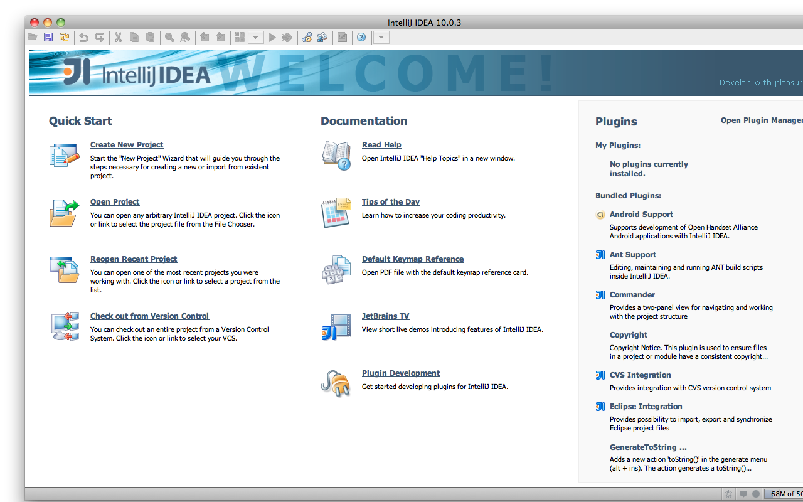
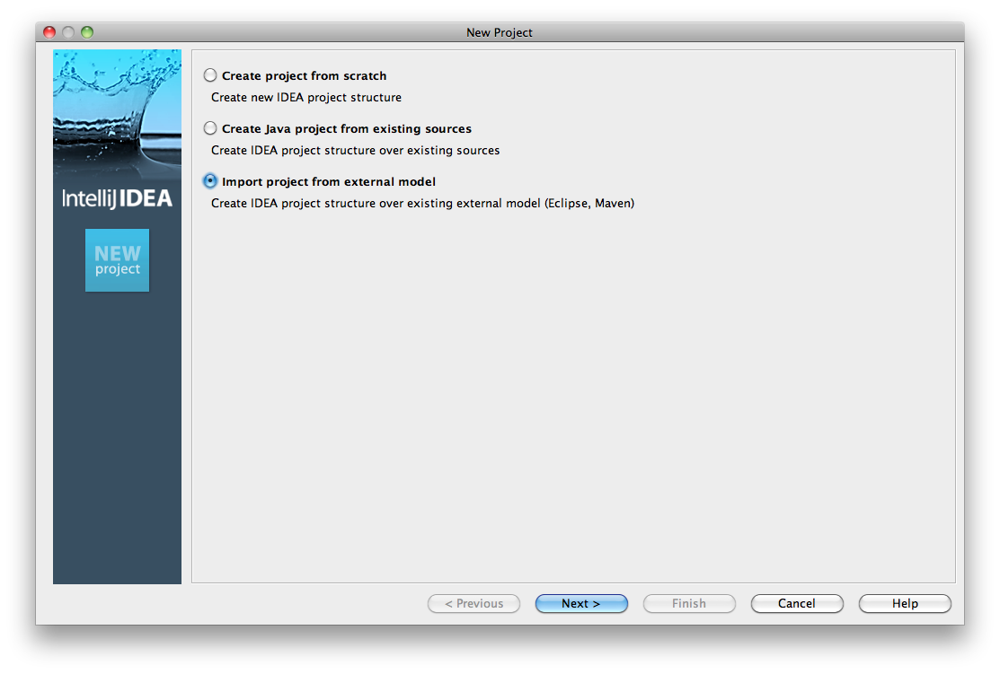
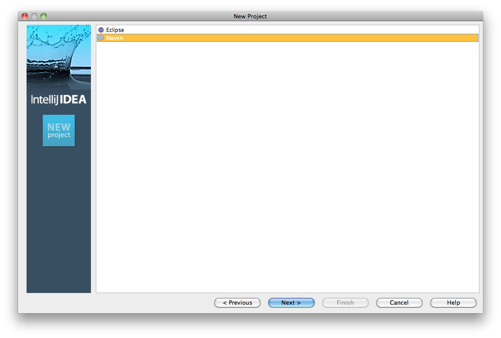
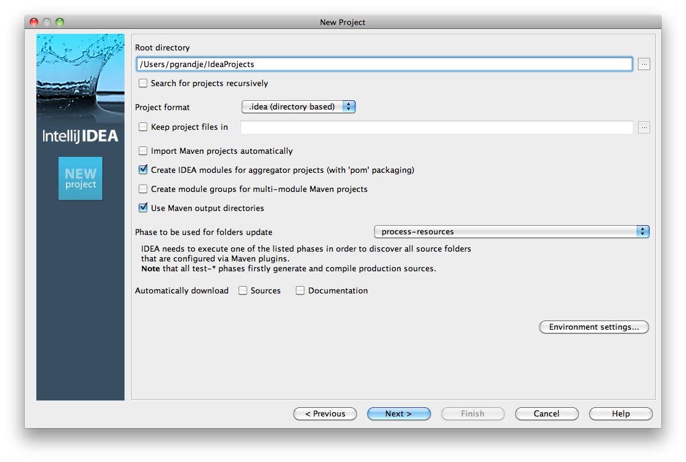
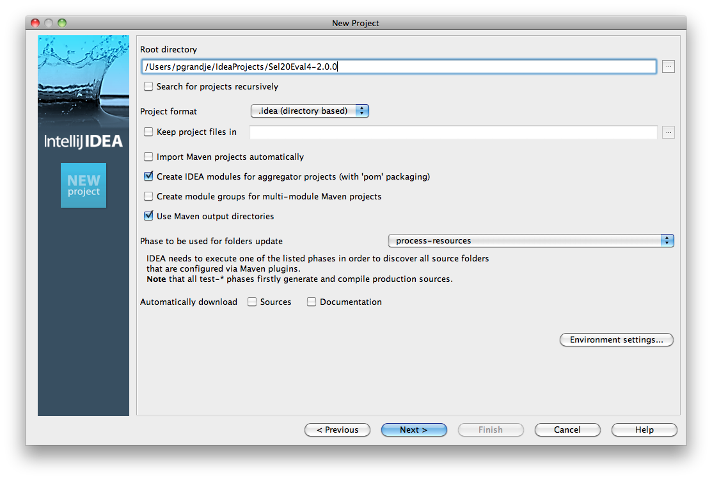

Importing Sel2.0 Project into IntelliJ Using Maven
==================================================

.. _importing-maven-into-intellij-reference:

*We are currently working on this appendix.  The information provided
here is accurate, although it may not be finished.*

In this appendix we provide the steps, including screen captures, showing
how to create a Selenium 2.0 java client-driver project in IntelliJ IDEA.
These steps assume you have already used maven with a pom.xml file to set up the 
project.  This process is described in the Selenium 2.0 chapter.  You must
have followed that process before you can perform these steps.  This appendix
then shows you how to import the maven-created Selenium 2.0 java
project into IntelliJ.

First, open IntelliJ and from the entry page, click Create New Project.

From the New Project dialog select Import Project from External Model.
   

   
From the list of project types, select maven.
   

   
Now you will see a dialog allowing you to set project options including the 
project's root directory.

Click the '...' button to set the root folder.

.. image:: images/Appendix_Sel20_Java_Img04a_SetRootFolder.png
   :class: align-center

Now the settings dialog will show the directory you just selected.

