Importing Sel2.0 Project into IntelliJ Using Maven
==================================================

.. _importing-maven-into-intellij-reference:

*We are currently working on this appendix.  The information provided
here is accurate, although it may not be finished.*

In this appendix we provide the steps, including screen captures, showing
how to create a Selenium 2.0 java client-driver project in IntelliJ IDEA.
These steps assume you have already used maven with a pom.xml file to set up the 
project.  This process is described in the Selenium 2.0 chapter.  You must
have followed that process before you can perform these steps.  This appendix
then shows you how to import the maven-created Selenium 2.0 java
project into IntelliJ.

First, open IntelliJ and from the entry page, click Create New Project.

.. image:: images/Appendix_Sel20_Java_Img01_EntryPage.png
   :class: align-center

From the New Project dialog select Import Project from External Model.
   
.. image:: images/Appendix_Sel20_Java_Img02_ImportProject.png
   :class: align-center
   
From the list of project types, select maven.
   
.. image:: images/Appendix_Sel20_Java_Img03_SelectMaven.png
   :class: align-center
   
Now you will see a dialog allowing you to set project options including the 
project's root directory.

.. image:: images/Appendix_Sel20_Java_Img04_RootDirAndProjOptions.png
   :class: align-center

Click the '...' button to set the root folder.

.. image:: images/Appendix_Sel20_Java_Img04a_SetRootFolder.png
   :class: align-center

Now the settings dialog will show the directory you just selected.

.. image:: images/Appendix_Sel20_Java_Img05_RootFolderSet.png
   :class: align-center

This next dialog shows the name of your maven project as specified in the pom.xml file.
Select your maven project and continue.

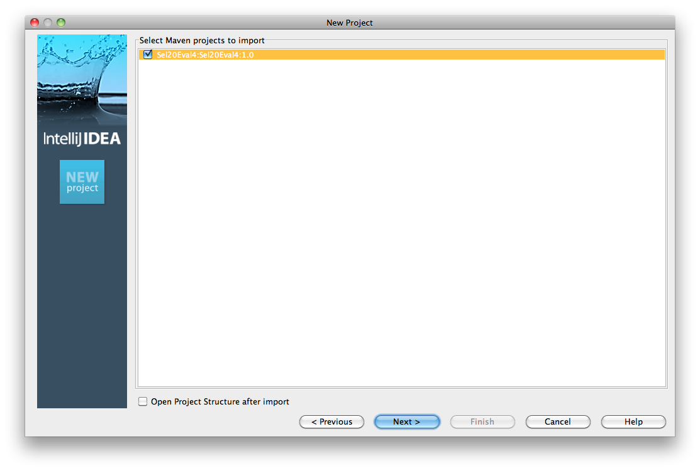

Enter a name for your project.

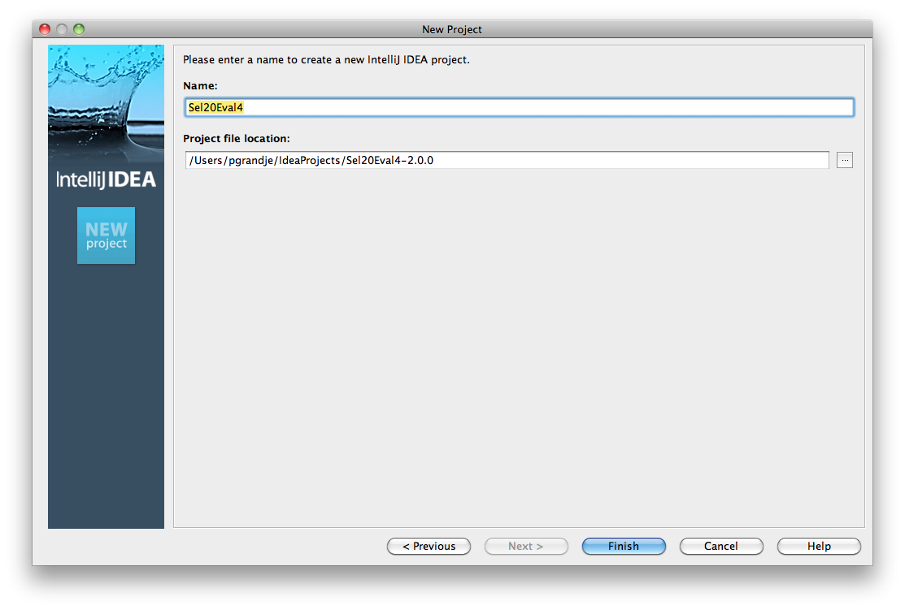
   
Once your project has been imported it should look like this in IntelliJ.

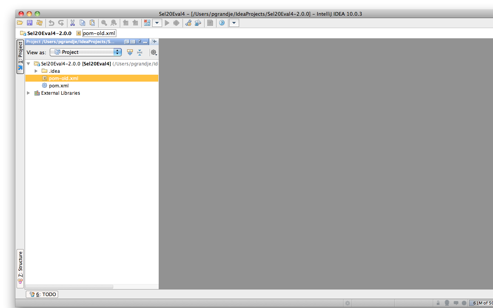

The maven project download many dependencies (libraries) when you originally ran
'mvn install'.  Now in IntelliJ you can see all these libraries.  These next two
screen captures shows the libraries you should now have in your project.

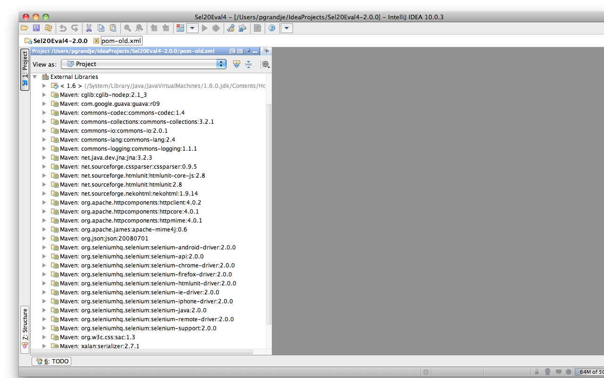

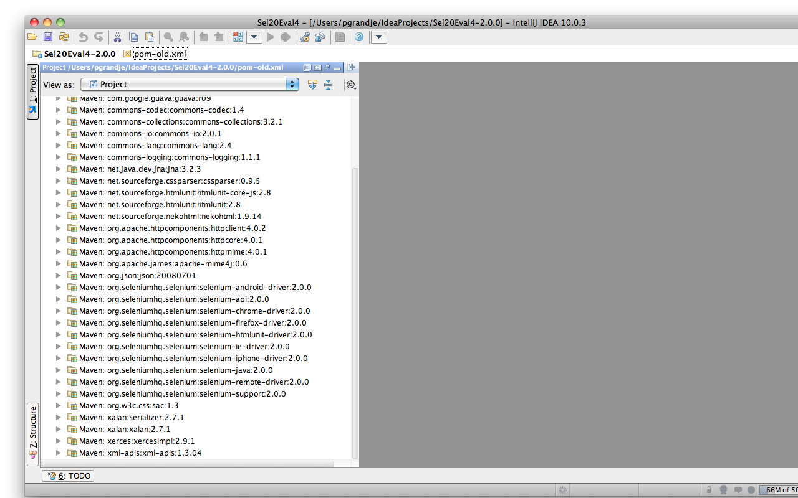

Before you can start writing Selenium code, you still need to create a module and at least
one Java class (a .java file).  First select the Project's root in IntelliJ and right click.

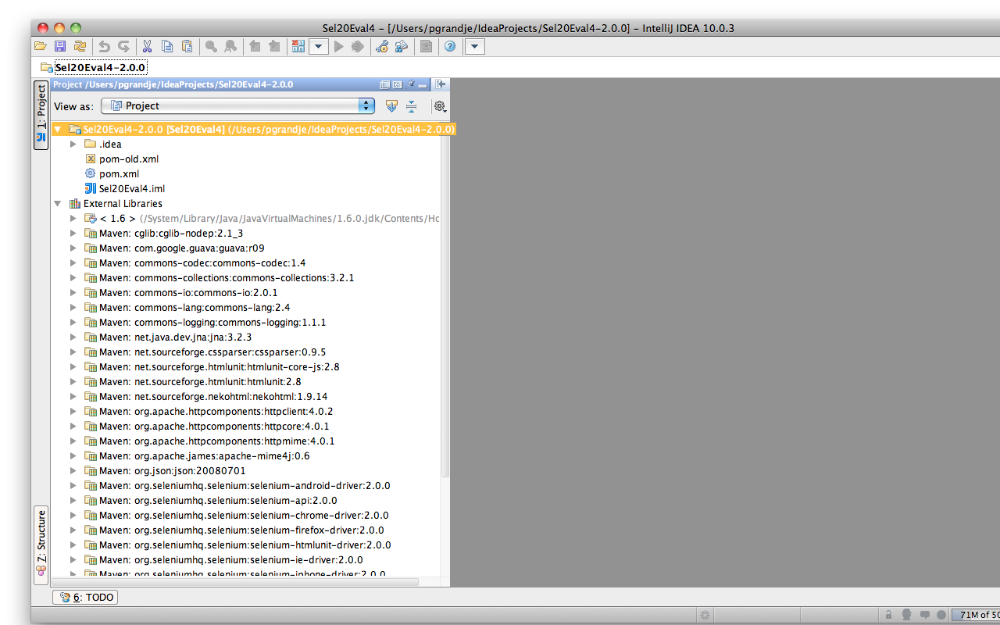

And select Create Module.

.. image:: images/Appendix_Sel20_Java_Img12_SelectCreateModule.png
   :class: align-center

In the dialog select the radio button Create Module From Scratch.

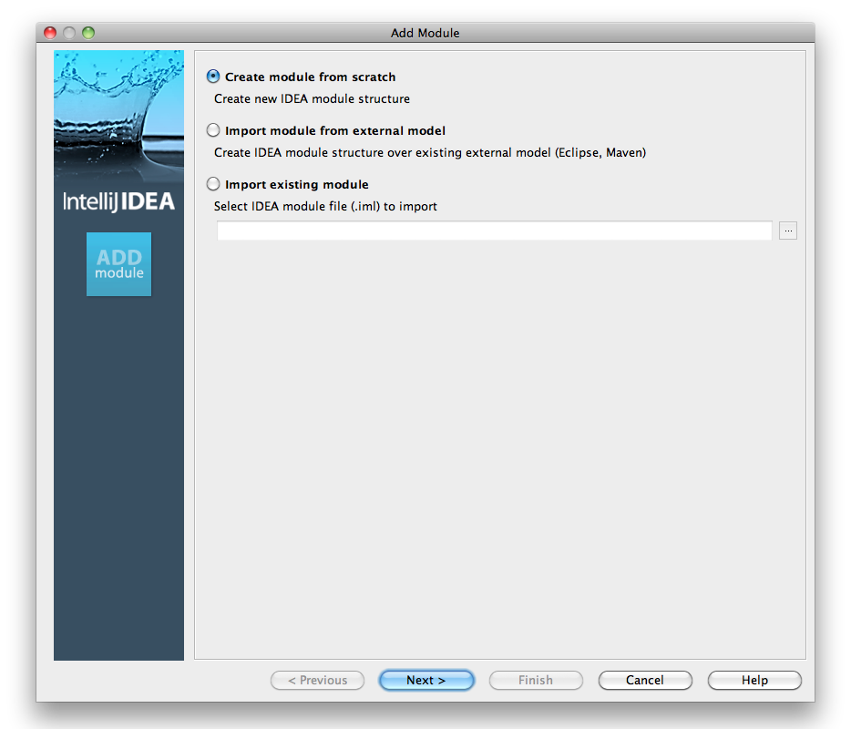

Select Java Module and enter a name for the new module.

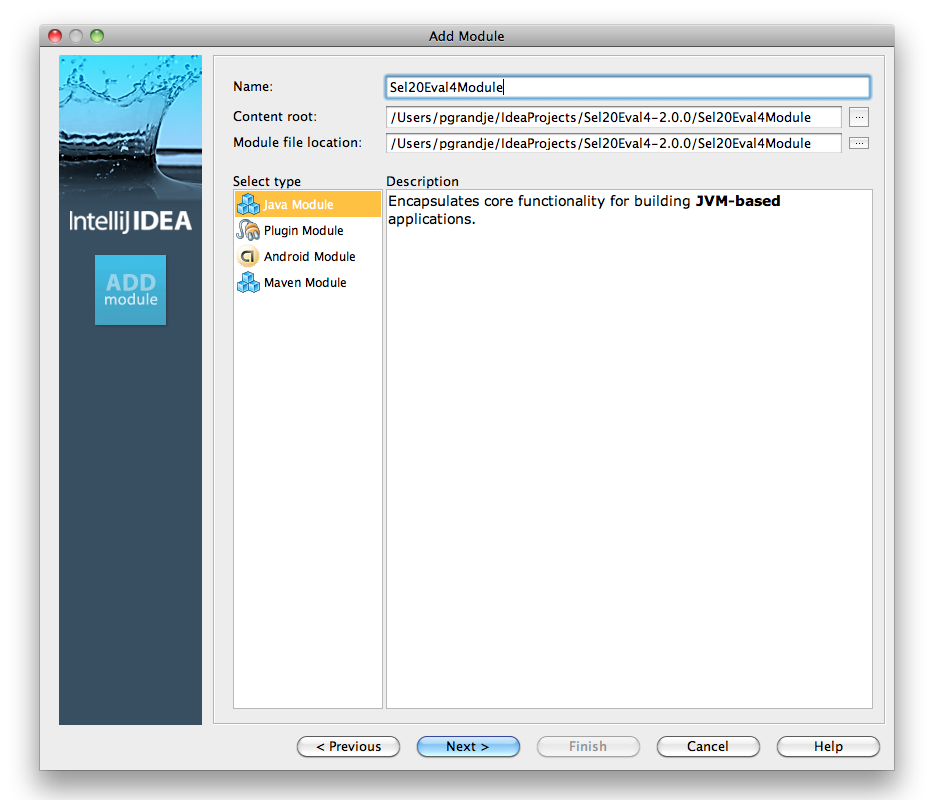

And next, you must create a folder for the source code.  By convention this is almost
always named 'src'.

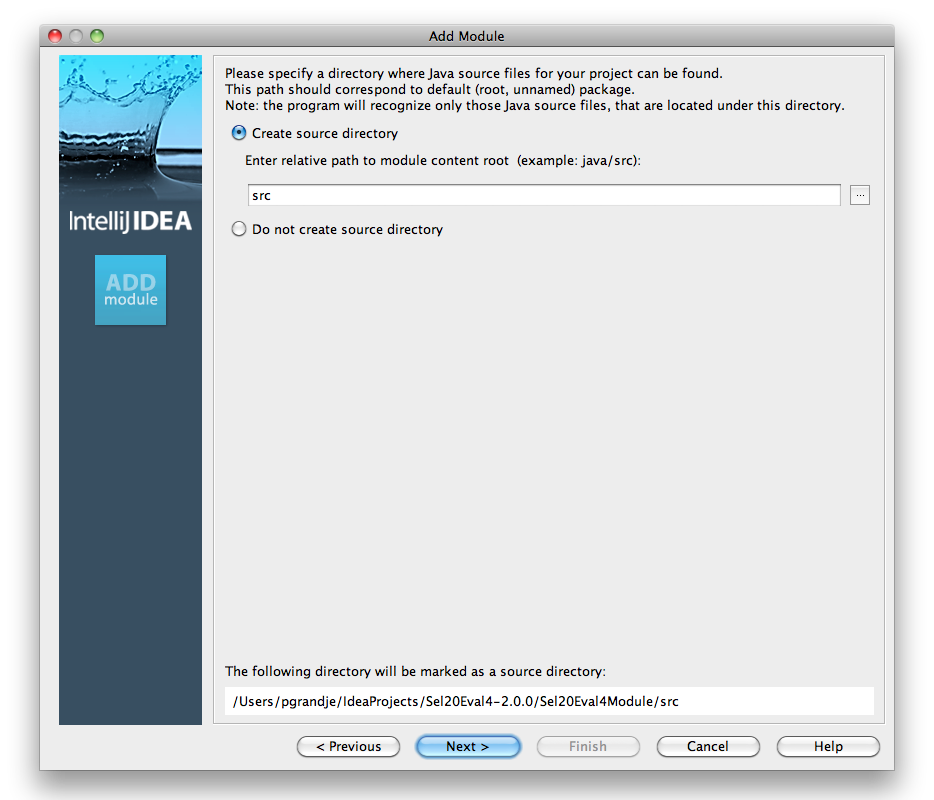

Now we're on the last dialog.  Typically you don't need to select any 'technollogies' here.
Unless you know for a fact you will be using Groovy or some other technology.

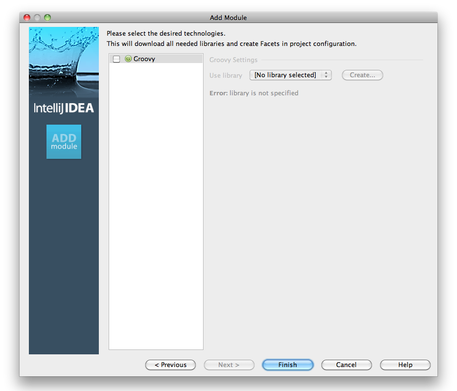

Now that the module is created, your project should show the following structure.

.. image:: images/Appendix_Sel20_Java_Img17_ModuleCreated.png
   :class: align-center

Finally, you need to create a .java file with a corresponding java class.

.. image:: images/Appendix_Sel20_Java_Img18_SelectCreateJavaClass.png
   :class: align-center

Enter the class name.

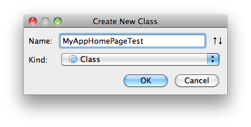

The .java file should now be created.  It should look like this in your project.

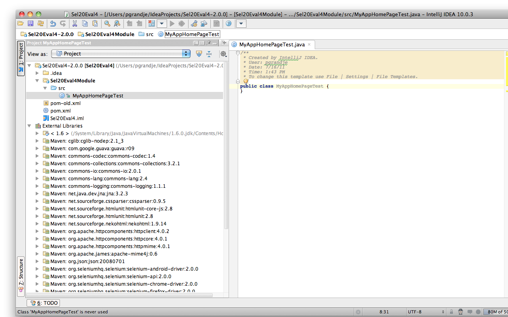

If your project now looks like the one displayed above, you're done, congrats!
And hope you enjoy coding your first Selenium automation!